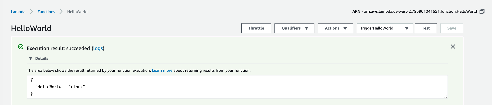

# Hello World with AWS Lambda using dotnet core 2.1 runtime

Requirements:
- VSCode
- C# for VSCode
- C# Extensions… Extension for VSCode

## Create a C# project
```
dotnet new classlib -n HelloLambda -f netcoreapp2.1
```

## Simple Lambda Handler Function

`Class1.cs`

```
using System;
namespace HelloLambdaNameSpace
{
    public class MyHandlerClass
    {
    }
}
```

## Update dependencies

`HelloLambda.csproj`

```
<Project Sdk="Microsoft.NET.Sdk">
  <PropertyGroup>
    <TargetFramework>netcoreapp2.1</TargetFramework>
  </PropertyGroup>
  <ItemGroup>
    <PackageReference Include="Amazon.Lambda.Core" Version="1.0.0" />
    <PackageReference Include="Amazon.Lambda.Serialization.Json" Version="1.3.0" />
    <DotNetCliToolReference Include="Amazon.Lambda.Tools" Version="2.2.0" />
  </ItemGroup>
</Project>
```
## Create the handler function

`MyHandlerClass`

```
using System;
using Amazon.Lambda.Core;
using Amazon.Lambda.Serialization.Json;
using System.Threading.Tasks;

namespace HelloLambdaNamespace
{
  public class MyHandlerClass {
   [LambdaSerializer(typeof(JsonSerializer))]
   public async Task<Result> HandleFunction(Request request)
   {
    return new Result 
    {
      HelloWorld=request.Name
    };
   }
 }
 public class Request{
  public string Name { get; set; }
 }
 public class Result {
  public string HelloWorld { get; set; }
 }
}
```

## Execute commands
`dotnet restore` and `dotnet build`

## Create the package
```
dotnet lambda package -c Release -o ../HelloWorldLambda.zip -f netcoreapp2.1
```

## Create AWS Lambda
- Go to AWS Console
- Choose AWS Lambda
  - Choose "Author from scratch"
  - Name: "HelloWorld"
  - Role: "Create new role from template(s)"
  - Click "Create function"

## Inside your Lambda function

About the Handler:

Handler is split into 3 parts, separated by ::

ASSEMBLY :: NAMESPACE :: METHOD

Steps
- Handler: `HelloLambda::HelloLambdaNamespace.MyHandlerClass::HandleFunction`
- Click Save
- Click Test
- MyEventName: "TriggerHelloWorld"
- Key value pair:
```
{
 "name": "Clark Ngo"
}
```
- Click Test again



Source: https://cabbagetech.blog/2018/08/03/lets-deploy-simple-aws-c-sharp-lambda/